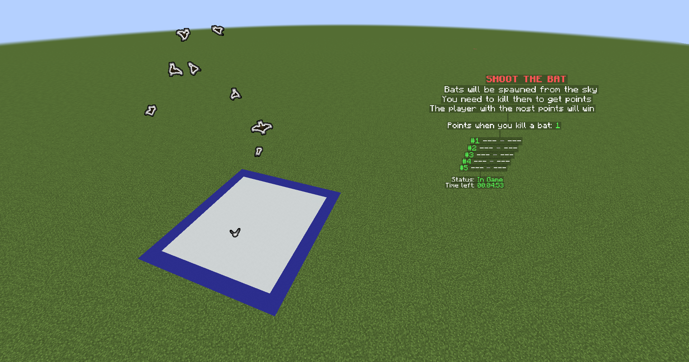

Games In The Box is a certain minigame system for Spigot servers, with the idea of "multiple games in a single arena". It's mainly for hub & event places, but admins can use this in more scenarios (like a separated gamemode), thanks to the highly flexibility it has. Developers can also make their own games and add it via the expansion system or just a hook.

## Feature

* Multiple games in a region (box)
* [Built-in games]({})
* [Picker]({}) to choose an arena
* Extension system
* [PlaceholderAPI](https://www.spigotmc.org/resources/placeholderapi.6245/) support
* In-game Editor
* API to create games _soon_

## Showcase

## Video

{}
The video is a showcase for an old version of this plugin.
{}

<iframe width="560" height="315" src="https://www.youtube.com/embed/YNpN9GMg_k4" title="YouTube video player" frameborder="0" allow="accelerometer; autoplay; clipboard-write; encrypted-media; gyroscope; picture-in-picture; web-share" allowfullscreen></iframe>
