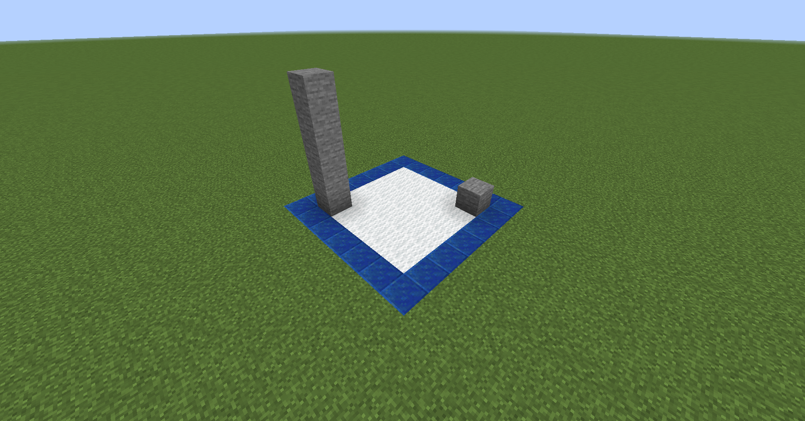
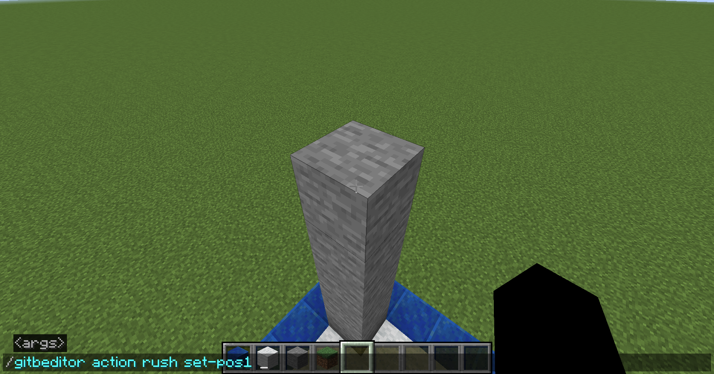
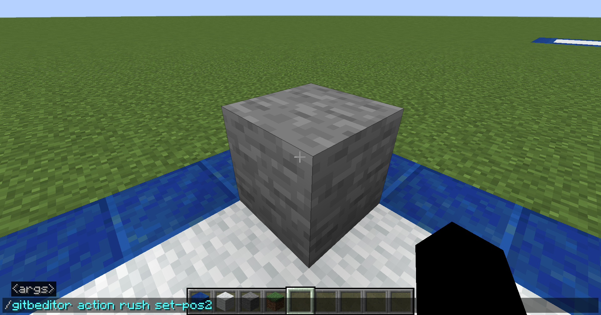
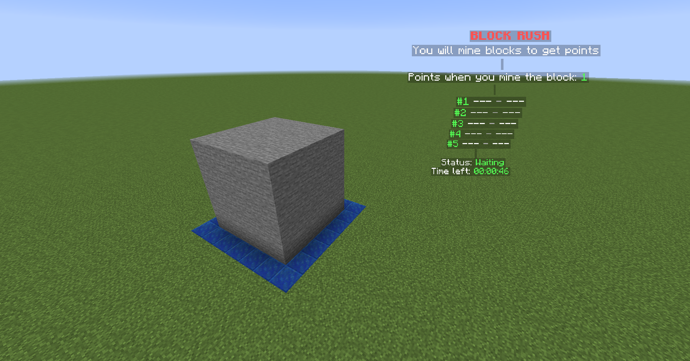

+++
title = "Block Rush"
weight = 2
+++

{}Download{}

## Install

1. Go to [the download page](https://github.com/GamesInTheBox-MC/BlockRush/releases)
2. Choose the latest version
3. Download the `-shaded` file
4. Copy the downloaded file to the folder `plugins/GamesInTheBox/expansions`
5. Restart the server

## How to play

A box of blocks would appears at the game arena. Players must mine the blocks to earn points. Those who have the highest points would win the game.

## Set up

1. Build a place for the box

{}
The stones are for the two corners of the box
{}

2. Look at the first corner and type `/gitbeditor action rush set-pos1`

3. Look at the second corner and type `/gitbeditor action rush set-pos2`

4. Configure [additional settings](#additional-settings)

5. Save the settings as a new arena by typing `/gitbeditor save rush <planner> <arena>`

6. Clear the unnecessary blocks. Your new arena will be available after reloading

## Additional Settings

{}
The settings below are available as the actions of the command `/gitbeditor action rush <action> [args]`

For example, the action `set-point <number> block` is relevant to the command `/gitbeditor action rush set-point <number> block`

Use the command `/gitbeditor usage rush` to get the full list of available actions and their usage

Use the command `/gitbeditor status rush` to get the status of the settings, including the current values for each one of them
{}

### Point

* `set-point <number> block` to set the points a player would receive when he breaks a block

### Reward

* `add-reward <top> <command>` to add a new `<command>` to be executed when the player is at the position `<top>`

{}
* You can use some placeholders for the `<command>`:
  * `{top}`: Get the top position of the player
  * `{name}`: Get the name of the player
* `<top>` starts from `1`. A value of `-1` indicates that the reward is for all players
{}

* `clear-reward <top>` to clear all commands at the position `<top>`
* `clear-all-reward` to clear all commands at all the top
* `set-min-players-to-reward <number>` to set how many players are required to start the reward

{}
Set the `<number>` to `-1` to disable the limit
{}

### Hologram

* `new-hologram` to create a new hologram at your current location
* `set-hologram-location <index>` to move the hologram at the `<index>` to your current location

{}
The `<index>` of the hologram starts from `0`, and it is provided as the output of the action `new-hologram`
{}

* `add-hologram-line <index> <line>` to add the `<line>` at the end of the hologram at the `<index>`

{}
You can use default hologram lines provided by the `default-hologram-lines` setting at the file `messages.yml` in the expansion's folder

To use these lines, set the `<line>` to `default:<name>`, with the `<name>` indicating the name of the default hologram lines

For example, if you want to use the `description` hologram lines, the appropriate `<line>` will be `default:description`
{}

* `clear-hologram-line <index>` to clear all lines of the hologram at the `<index>`
* `remove-hologram <index>` to remove the hologram at the `<index>`
* `clear-all-hologram` to clear all holograms

### Block

* `set-material <material> <number>` to set the probability `<number>` of the `<material>` as a block in the box
* `drop-item-on-break <true/false>` to enable / disable dropping items when a player breaks a block

### Time

* `set-waiting-time <time>` to set the `<time>` before the game starts
* `set-in-game-time <time>` to set the `<time>` the game runs
* `set-ending-time <time>` to set the `<time>` before the game ends

{}
The unit of `<time>` is millisecond by default

You can set the `<time>` in seconds by adding `s` after the time. For example, `30s` is for 30 seconds

Similarly, you can set the `<time>` in minutes by using `m` (`30m` for 30 minutes)
{}

## Variable

| Variable | Description |
| --- | --- |
| `{game_point}` | The points of the player |
| `{game_top}` | The top position of the player |
| `{game_time_left}` | The time left of the game arena |
| `{game_min_players_to_reward}` | The minimum players to start the reward |
| `{game_point_block}` | The points to give when a player mines a block |
| `{game_top_name_<number>}` | The name of the player at the top position `<number>` |
| `{game_top_value_<number>}` | The value of the player at the top position `<number>` |

## Action

{}
The actions below are used in the command `/gitb action <planner> <action> [args]`

For example, the command to use the action `skip-time` is `gitb action <planner> skip-time`
{}

* `skip-time` to skip the time on a state of the current arena
